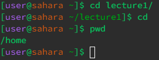
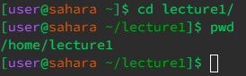
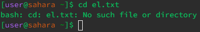
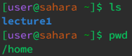
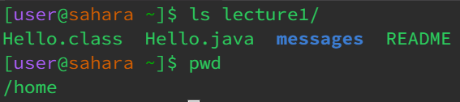
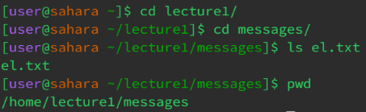
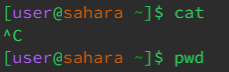
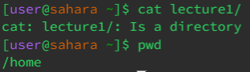
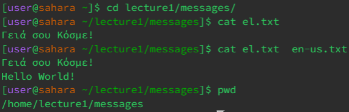

# Lab Report 1
__1. cd__
   - *No Argument*
        - 
        - If you're already in the home directory, inputting cd with no argument does nothing. However, if you're in another directory that isn't the home directory, cd with no argument will take you back to the home directory.
        - There is no error with the output.
    
   - *Directory Argument*
        - 
        - When adding a directory argument after the command cd, the output would be that you're in that directory now which means you're now able to only access other files in that directory but not ones outside of that.
        - There is no error with the output.

   - *File Argument*
        - 
        - When you use cd to path to a file, you get an output of "(text name): Not a directory" and that's true, the file isn't a directory and cd is the changing of directory so you can't change from a directory to a file.
        - There is an error because the purpose of the cd command is to change directories and because a file is not a directory, the command won't be able to run properly.  

__2. ls__
   - *No Argument*
        - 
        - ls with no arguemnts just lists the contents of the current directory that you're in.
        - There is no error with the output.
    
   - *Directory Argument*
        - 
        - ls with a directory as an argument lists the contents of the directory specified with the command.
        - There is no error with the output.
    
   - *File Argument*
        - 
        - When you use ls to path to a file, it doesn't list the contents in that file but just lists the specified file instead.
        - There is no error with the output.
    
__3. cat__
   - *No Argument*
        - 
        - When you use cat with no argument, there is no output and instead feels like the command just keeps running before you have to click ctrl+c to stop it.
        - There is no error with the output.
    
   - *Directory Argument*
        - 
        - When you use cat with a directory in the argument, it gives you the output "cat: (directory name): Is a directory" which its true because the cat command is used for displaying the content of files, not directories.
        - There is an error because since cat is only used for files, and the argument was a directory, it would cause an error.
    
   - *File Argument*
        - 
        - When you use cat with a path to a file, it will display the contents of that file and if you put 2 file names in the arguments, it will just display both the files' contents.
        - There is no error with the output.
