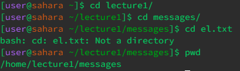

# Lab Report 1
1. cd
   - No Argument
        - 
        - If you're already in the home directory, inputting cd with no argument does nothing. However, if you're in another directory that isn't the home directory, cd with no argument will take you back to the home directory.
    
   - Directory Argument
        - 
        - When adding a directory argument after the command cd, the output would be that you're in that directory now which means you're now able to only access other files in that directory but not ones outside of that.

   - File Argument
        - 
        - 
