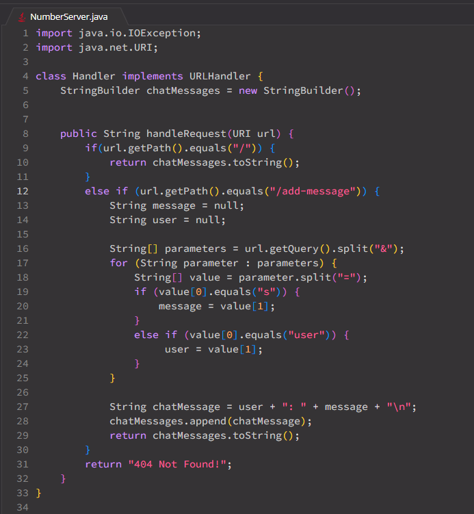

__Part 1__
  - *Code for ChatServer*
    - 

    
  - *Using `/add-message` #1* 
    - `/add-message?s=Hello%20World&user=jeff`
    - 
    - The `handleRequest` method is called everytime `add-message` is used in the URL.
    - The relevant argument in `handlerequest` is the only argument which is the URL. Once the URL comes through, the instance varibales `user` and `message` are initailized as null. A new `StringBuilder` object (ChatMessages) is also created.
    - Once the url is entered and the request is split from `&` and then those split `String`s are split again by `=` and then from there, `Hello World` would be stored into the message field while `jeff` is stored in the user field which both fields were initiated in the beginning. Now, that those fields are updated, chatMessage will now say `jeff: Hello World` and then append this to ChatMessages which will then save and return it.

      
  - *Using `/add-message` #2*
    - `/add-message?s=Hi%20There&user=bot`
    - 
    - The `handleRequest` method is called everytime `add-message` is used in the URL.
    - The relevant argument in `handlerequest` is the only argument which is the URL. Once the URL comes through, the instance varibales `user` and `message` are initailized as null. `StringBuilder` object (ChatMessages) stays the same from the last added message.
    - The process is similar to the very first message but obviously just different `user` and `message` because the url was different. Now, `user` would store `bot` and message would store `Hi There` and then `bot: Hi There` will be added to `ChatMessages` along with the first message from before. So now, if a simple `/` is at the end without `add-message`, it would show the history of the chat using `ChatMessages`.
   

__Part 2__
