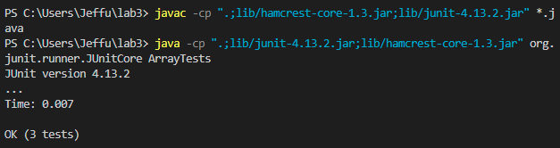

__Part 1 - Bugs__
- *Includes failure inducing input*
  - <pre>
    public void testReverseInPlace2() {
    int[] input2 = {1, 2, 3};
    ArrayExamples.reverseInPlace(input2);
    assertArrayEquals(new int[]{3, 2, 1}, input2);
    }
  
- *Does NOT include failure inducing input*
  - <pre>
    public void testReverseInPlace() {
    int[] input1 = { 3 };
    ArrayExamples.reverseInPlace(input1);
    assertArrayEquals(new int[]{ 3 }, input1);
	}
  
- *Code causing failure inducing input*
  - <pre>
    static void reverseInPlace(int[] arr) {
    for(int i = 0; i < arr.length; i += 1) {
      arr[i] = arr[arr.length - i - 1];
     }
    }
  </pre>

- *Symptom for failure inducing input from above code*
  - 
 
- *Code that DOES NOT cause failure inducing input*
  - ```
     static void reverseInPlace(int[] arr) {
    int temp = 0;
    for(int i = 0; i < arr.length / 2; i += 1) {
      temp = arr[i];
      arr[i] = arr[arr.length - i - 1];
      arr[arr.length - i - 1] = temp;
     }
    }
    ```
- *Symptom for NON failure inducing input*
  - 

- *FIX*
  - These changes fix the bugs that consisted with the given code because it now swaps the two elements in the corresponding positions of the array instead of doing it with respect to the middle element.
 
__Part 2 - Researching Commands__
- I chose the `find` command
  - `type` command line option
    - This command line option determines what kind of files are in specific directories. For example, the command `find path -type f` looks for all the elements in the path and f tells it to look for elements that are files. Similarly, the command `find path -type d` looks for all the elements in the path but d tell it to look for elements that are directories and prints them out. 
    - *Example 1*
      - ```
        Jeffu@Jeff MINGW64 ~/docsearch (main)
        $ find technical/biomed/ -type f
        technical/biomed/1468-6708-3-1.txt
        technical/biomed/1468-6708-3-10.txt
        technical/biomed/1468-6708-3-3.txt
        technical/biomed/1468-6708-3-4.txt
        technical/biomed/1468-6708-3-7.txt
        technical/biomed/1471-2091-2-10.txt
        technical/biomed/1471-2091-2-11.txt
        ... OMITTING 100+ files ...
        ```
      
      - This output prints out all the file type files in the biomed directory. (Because the biomed directory have so many files, only the first few are shown.)
    - *Example 2*
      - ```
        Jeffu@Jeff MINGW64 ~/docsearch (main)
        $ find technical/ -type d
        technical/
        technical/911report
        technical/biomed
        technical/government
        technical/government/About_LSC
        technical/government/Alcohol_Problems
        technical/government/Env_Prot_Agen
        technical/government/Gen_Account_Office
        technical/government/Media
        technical/government/Post_Rate_Comm
        technical/plos
        ```
      
      - This output prints out all the files that are directories in the technical directory.
    - This command line option is useful because when were dealing with large directories, we can identify all the elements that are files or directories to better understand the large directory as a whole. The source that I used for this command line option is this <a href="https://www.geeksforgeeks.org/find-command-in-linux-with-examples">Webpage</a>

  - `empty` command line option
    - This command line option prints out any empty files / subdirectories in a specfied directory. This command goes through the specified path and looks for any files / subdirectories that have no content in them. If there are none empty, output prints nothing.
    - *Example 1*
      - ```
        Jeffu@Jeff MINGW64 ~/docsearch (main)
        $ find technical/biomed/ -empty
        ```
      
      - The output of this command was nothing, meaning that there are no empty files in the biomed directory.
    - *Example 2*
      - ```
        Jeffu@Jeff MINGW64 ~/docsearch (main)
        $ find technical/ -empty
        ```
      
      - Similarly from the previous command, there was no output with the given terminal command, showing that there are no files nor subdirectories in the `technical` directory that are empty.
    - This command line option is useful because in large directories where it's hard to go through each file / directory manually, you can check which ones are empty and then decide whether you want to keep or delete them. This makes it more efficient and easier in filtering out empty fils. Similarly to the `type` command line, the source I used was this <a href="https://www.geeksforgeeks.org/find-command-in-linux-with-examples">Webpage</a>
    
  - `size` command line option
    - This command line option prints out all the files or directories that are of a specified size `n` when running the command. This option comes with a few suffixes for `n`, `c` for bytes, `k` for kilobytes, `M` for megabytes and `G` for gigabytes. The command line is `find path -find +/-n` (`+` meaning greater than the specified size, while `-` meaning less than the specified size).
    - *Example 1*
      - ```
        Jeffu@Jeff MINGW64 ~/docsearch (main)
        $ find technical/biomed/ -size -2G
        technical/biomed/
        technical/biomed/1468-6708-3-1.txt
        technical/biomed/1468-6708-3-10.txt
        technical/biomed/1468-6708-3-3.txt
        technical/biomed/1468-6708-3-4.txt
        technical/biomed/1468-6708-3-7.txt
        ... OMITTS 30+ FILES...
        ```
      
      - The output of this command prints out all the files that are less than 2 gigabytes in the `biomed` directory.
    - *Example 2*
      - ```
        Jeffu@Jeff MINGW64 ~/docsearch (main)
        $ find technical/911report/ -size +50k
        technical/911report/chapter-1.txt
        technical/911report/chapter-11.txt
        technical/911report/chapter-12.txt
        technical/911report/chapter-13.1.txt
        technical/911report/chapter-13.2.txt
        technical/911report/chapter-13.3.txt
        technical/911report/chapter-13.4.txt
        technical/911report/chapter-13.5.txt
        technical/911report/chapter-2.txt
        technical/911report/chapter-3.txt
        technical/911report/chapter-5.txt
        technical/911report/chapter-6.txt
        technical/911report/chapter-7.txt
        technical/911report/chapter-8.txt
        technical/911report/chapter-9.txt
        ```
      
      - The output of this command prints out all the files that are greater than 50 kilobytes in the `911report` directory.
    - This command line option is useful because it lets you more efficiently clean up directories that may be too large or small. Also, this command helps you identify files that are more storage costly and then be able to allow you to know when to create more space if needed. The source that I used for this command line option is this <a href="https://linuxize.com/post/how-to-find-files-in-linux-using-the-command-line/">Webpage</a>.

  - `mtime` command line option
    - This command line option prints out all the files that have been in a specified directory for a certain amount of time `n` (meaning if it has been modified since then). The command line is `find path -mtime +/-n` (`+` meaning greater than the specified time `n`, while `-` meaning less than the specified time `n`).
    - *Example 1*
      - ```
        Jeffu@Jeff MINGW64 ~/docsearch (main)
        $ find technical/911report/ -mtime +5
        technical/911report/
        technical/911report/chapter-1.txt
        technical/911report/chapter-10.txt
        technical/911report/chapter-11.txt
        technical/911report/chapter-12.txt
        technical/911report/chapter-13.1.txt
        technical/911report/chapter-13.2.txt
        technical/911report/chapter-13.3.txt
        technical/911report/chapter-13.4.txt
        technical/911report/chapter-13.5.txt
        technical/911report/chapter-2.txt
        technical/911report/chapter-3.txt
        technical/911report/chapter-5.txt
        technical/911report/chapter-6.txt
        technical/911report/chapter-7.txt
        technical/911report/chapter-8.txt
        technical/911report/chapter-9.txt
        technical/911report/preface.txt
        ```
      - The output of this command prints out all the files that have been in the specified directory for more than 5 days.
    - *Example 2*
      - ```
        Jeffu@Jeff MINGW64 ~/docsearch (main)
        $ find technical/911report/ -mtime -5
        ```
      - The output of this command prints out nothing because the files in the `911report` directory have been in there more than 5 days (from previous example).
    - This command line option is useful because it gives you a timeframe for when the files in a specified directory was modified without having to explicitly look at the file structure or specific file information. The source that I used for this command line option is this <a href="https://www.redhat.com/sysadmin/linux-find-command">Webpage</a>.
        
      
      


  
