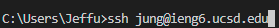

__Part 1: Vim__
- *Step 4*
  - I was tasked to log into our `ieng6` account. Since I logged into my `ieng6` account previously from trying to perfect the efficiency, I was about to use the up arrow key to when I used that command last.
  - 
  - When in the terminal, I pressed the up arrow key once and it brought up the last command I used outside of my `ieng6` account, which was the `ssh jung@ieng6.ucsd.edu` command.
  - Keys pressed: `<up> <enter>` . The `ssh jung@ieng6.ucsd.edu` command was 1 up in the command history.
 
- *Step 5*
  - I was tasked to clone the forked repository into my `ieng6` account. In order to make the process more efficient, I copied the protected SSH Key for my forked repository on my github page (git@github.com:jeffungg/lab7.git). Then, in my terminal, I typed `git clo<tab> <Command-V> <enter>`. To make the process more efficient, I typed `git clo` and then tab to let it finish it to `clone`. Pressing Command-V lets me pastes the copied SSH Key into the command line instead of manually typing it out.
  - 
  - Keys pressed: `<git clo> <tab> <Command-V> <enter>` . Forked repository is now cloned to my `ieng6` account.

- *Step 6*
  - I was tasked to run the JUnit tests provided in the `lab7` repository and see that they fail. During the lab, when trying to find the best way to compile and run properly, I was able to put both `javac` and `java` commands into one line. Because there were a lot of trial and errors when finding an effective way to do so, using the up arrow key will take too much time. So I used the `<Ctrl-R>` command. Using this command let me search through the command history by searching for the `javac` command that I wrote earlier. Because I was able to figure out how to run both `javac` and `java` commands with one line, that meant that I only needed to use the `<Ctrl-R>` command once instead of twice, improving the efficiency.
  - 
  - Keys pressed: `<Ctrl-R> javac <enter>` . Ran the tests and showed 1 failure.
  - 

- *Step 7*
  - 
