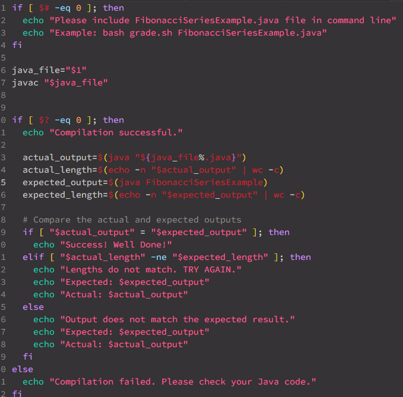
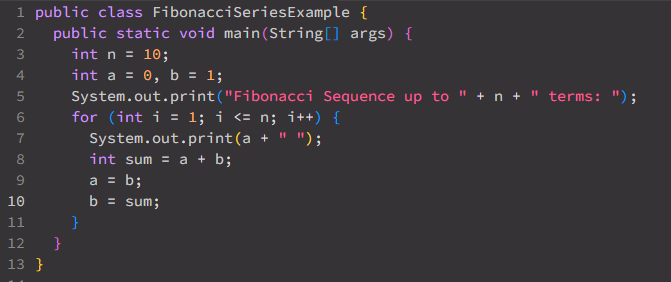
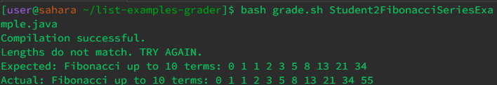
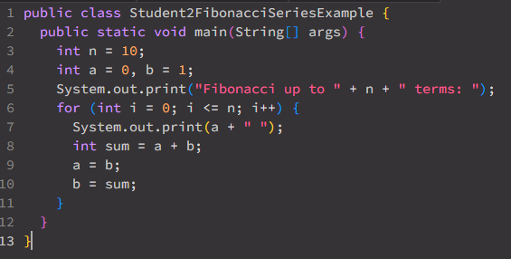
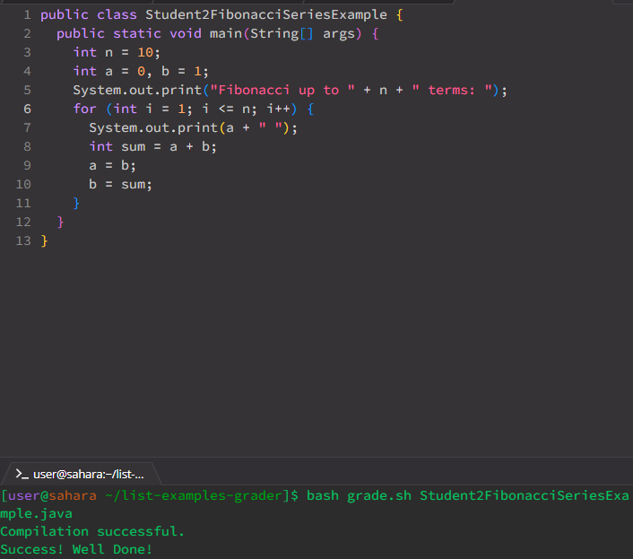
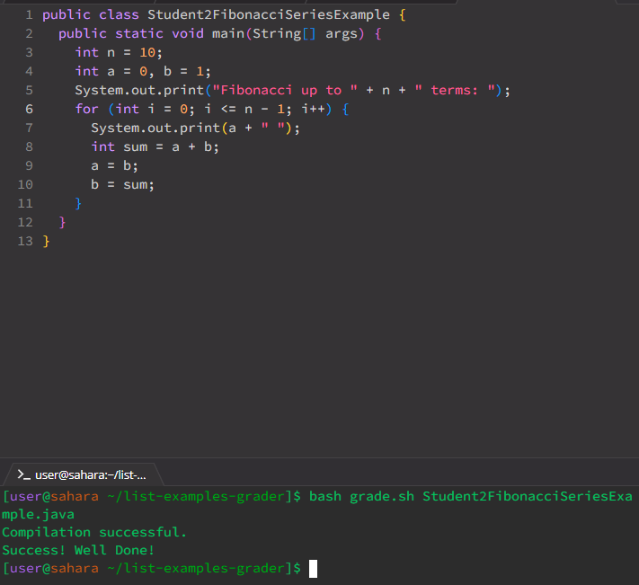

__Part 1: Debugging Scenario__

  *Background*
   - Students were tasked to create a function that would output the first 10 (Index 0-9) numbers of the Fibonacci Sequence. The output should say `Fibonacci Sequence up to 10 terms: 0 1 1 2 3 5 8 13 21 34`. The students were provided a grade.sh file to run their code on.
   - Code in grade.sh file
     - 
   - Correct code to output first 10 numbers of Fibonacci Sequence
     - 
     
  *1. Original Post from student*
       - Hi! I had a question about my Fibonacci Sequence code. WHen I ran the grade.sh file, I get that the length of my output does not match the length of the actual output. It looks like my code is adding the 11th number to the output. I'm not understanding what I'm doing wrong with my code. I think it'a most likely my for loop but I'm not sure what exactly is causing it to go to the 11th number.
       - 
       - 

   *2. Response from TA*
       - Hey! Great work on writing the code up! It looks like your program is correctly outputting the numbers in the fibonacci sequence but with just one minor error. Your feeling abbout the for loop is not wrong. There are more than one way to go about this. Because you already have a at 0 and b at 1, indexing from 0 would add an extra number. What can you change it to to make it not add an extra number? Try it out! IF you have anymore questions, feel free to make another post or continue on to this one!
     

   *3. Success from student*
        - Thanks! I figured it out. I found 2 options that I could've used to fix the bug. I found out that in my for loop, it was iterating through the loop 11 times so it was printing out the extra number in the end. So, to fix this, I set `int i = 1` and another way I found was leaving `int i = 0` and changing `i <= n - 1`. 
        - 
        - 

